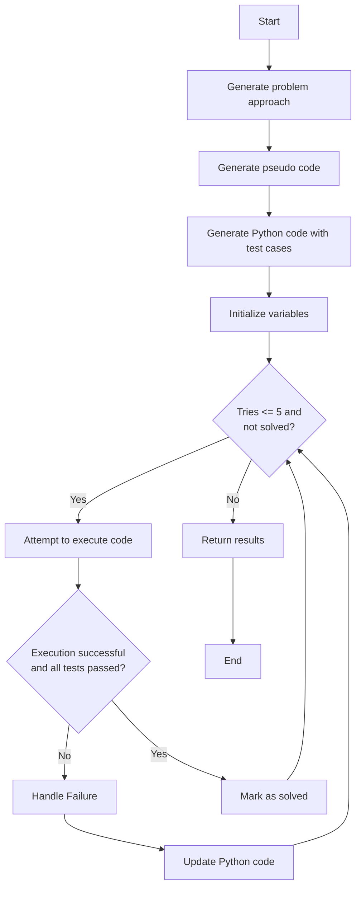
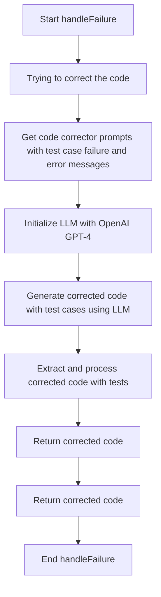

# DSA Problem Solver - a system that outperforms ChatGPT in solving unseen leetcode medium and hard problems

## Overview

The **DSA Problem Solver** project aims to simplify the process of solving Data Structures and Algorithms (DSA) problems by leveraging advanced language models and retrieval-augmented generation (RAG) techniques. This tool is designed to assist users in tackling challenging DSA problems, making the process more intuitive and less daunting.

### Current Approach:

Open to suggestions:

## Features

- **Agentic LLM Integration**: Utilizes language models to understand and generate solutions for various DSA problems by breaking it down into simpler steps
- **Retrieval-Augmented Generation (RAG)**: Enhances problem-solving capabilities by combining retrieval of latest information on the internet to support generation of tailored solutions.
- **Code Execution**: Uses native python engine to eecute code and test cases to enable iterative improvements based on error messages / test case failure

## Challenges

- **Getting an LLM to understand logic**
- **To break the barrier - the system is as good as the LLM used**

## Usage

1. **Input Problem Statement**:
   Provide the DSA problem statement either via the command line interface or through the web interface.

2. **Receive Solution**:
   The tool will analyze the problem using the Agentic LLM and RAG techniques, then provide a detailed solution with explanations.

3. **Explore Solutions**:
   Users can review the solutions and explanations, use the playground to test the solution and interact with the tool for further clarification or alternative approaches.

## License

This project is licensed under the MIT License - see the [LICENSE](LICENSE) file for details.

## Contact

For any questions or support, feel free to reach out.
